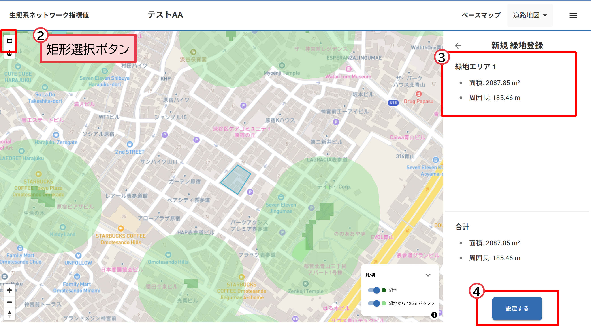

# 操作マニュアル

# 1 本書について

本書では、「生態系ネットワーク指標値算出機能」（以下「本システム」という。）の操作手順について記載しています。
国土交通省 優良緑地確保計画認定制度(TSUNAG)など国の制度で採用されている国土交通省「都市における生物多様性指標（簡易版）」に基づく、生態系ネットワーク指標値を算出する機能です。

# 2 使い方

## 2-1 プロジェクト一覧画面

① プロジェクト登録

・左上の「新規プロジェクト作成」ボタンを押し、プロジェクト名称および概要を入力し、登録します

① 対象エリア登録

・左上の「矩形選択」ボタンを押し、指標値を算出する緑地化を検討する対象のエリアを地図上でクリックしてポリゴンを登録します。

② 対象エリア面積表示

・指定したエリアの面積と周辺長が表示されます

③ 生態系ネットワーク指標値算出

・右下の「設定する」ボタンを押すと、選択したエリアを緑地を追加した場合の生態系ネットワーク指標値の算出を開始します。

・算出完了後、自動的に「生態系ネットワーク指標値結果画面」に遷移します。

## 2-2 生態系ネットワーク指標値結果画面

① 生態系ネットワーク可視化

・地図画面の左に緑地を追加する以前の生態系ネットワーク、右に緑地を追加した後の生態系ネットワークの状態を表示します

② 生態系ネットワーク指標値表示

・緑地を追加する以前の生態系ネットワーク指標値（A）と緑地を追加した後の生態系ネットワーク指標値（B）およびB-Aの値を表示します

② エクスポート

・右上のエクスポートボタンで、算出した指標値をPDFまたはExcelでダウンロードすることができます

